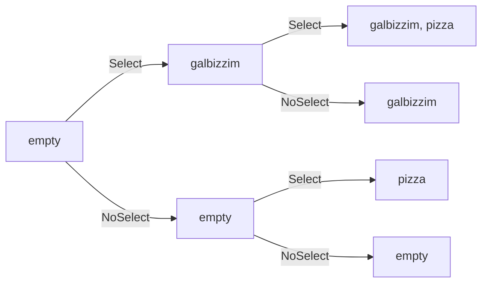

# 4-4 지수 시간 알고리즘

## - 다항 시간 알고리즘

반문의 수행 횟수를 입력 크기의 다항식으로 표현할 수 있는 알고리즘을 다항 시간 알고리즘이라고 부른다. 

예를 들어 N, N^2, ... , N^100의 수행 시간을 가지는 알고리즘들은 다항 시간 알고리즘이다. 다항 시간 알고리즘은 알고리즘 간에 엄청나게 큰 시간 차이가 날 수 있다. 따라서 다항 시간 알고리즘이라고 해서 알고리즘이 충분히 빠르다고는 할 수 없다.

하지만 다항 시간 알고리즘보다 더더욱 오랜 시간이 걸리는 알고리즘이 있다. 바로 지수 시간 알고리즘이다. 


## - 지수 시간 알고리즘

다음은 지수 시간 알고리즘의 예이다. 

------

Q. 집들이에 N명의 친구를 초대하려고 합니다. 할 줄 아는 M가지의 음식 중 무엇을 대접해야 할까를 고민하는데, 친구들은 각각 알러지 때문에 못 먹는 음식들이 있어서 아무 음식이나 해서는 안 됩니다. 각 친구가 먹을 수 있는 음식이 최소한 하나씩은 있으려면 최소 몇 가지의 음식을 해여 할까요?

(친구들이 못 먹는 음식과 만들 줄 아는 음식의 목록.)

|      | 갈비찜 | 피자 | 잡채 | 떡볶이 | 탕수육 | 닭강정 |
| ---- | ------ | ---- | ---- | ------ | ------ | ------ |
| 페이 | x      | o    | o    | o      | x      | x      |
| 지아 | x      | x    | x    | x      | o      | o      |
| 민   | o      | x    | o    | x      | o      | x      |
| 수지 | o      | o    | x    | x      | x      | o      |


A. 이렇게 여러 개의 답이 있고 그중 가장 좋은 답을 찾는 문제들을 푸는 방법중 간단한 방법은 모든 답을 일일이 고려해 보는 것입니다.

1. 만들 수 있는 모든 메뉴 목록 만들기.
2. 그 중 적합한 답을 고르기.




```c++
const int INF = 987654321; // 불가능한 메뉴 목록.
bool canEveryBodyEat(const vector<int>& menu); // 모두가 먹을 수 있는 메뉴인지 확인해 주는 함수.
int M;
int selectMenu(vector<int>& menu, int food){
  if(food == M){ // 메뉴 목록을 다 만듬.
    if(canEveryBodyEat(menu)) return menu.size();
    return INF;
  }
  int ret = selectMenu(menu, food + 1); //음식을 만들지 않는 경우
  menu.push_back(food);
  ret = min(ret, selectMenu(menu, food + 1)); // 음식을 만드는 경우 
  menu.pop_back();
  return ret;
}
```

위 알고리즘은 2^M가지의 경우의 수를 계산한다. 따라서 알고리즘의 수행 시간은 2^M이 된다. 

------

정리하자면 N이 하나 증가할 때마다 걸리는 시간이 배로 증가하는 알고리즘들을 지수 시간에 동작한다고 말한다.


## - 입력의 크기에 따라 수행 시간이 달라지는 경우

입력으로 주어지는 숫자의 개수기 아니라 그 크기에 따라 수행 시간이 달라지는 알고리즘 또한 지수 수행 시간을 가질 수 있다. 

그 예로는 소인수 분해 알고리즘이 있다. 

------

```c++
vector<int> factor(int n){
  if(n == 1) return vector<int>(1, 1);
  vector<int> ret;
  for(int div = 2; n > 1; ++div)
    while(n % div == 0){
      n /= div;
      ret.push_back(div);
    }
  return ret;
}
```

입력 값의 개수는 항상 하나지만 입력 값의 크기에 대해 수행 속도가 지수 시간이 걸린다.

------

